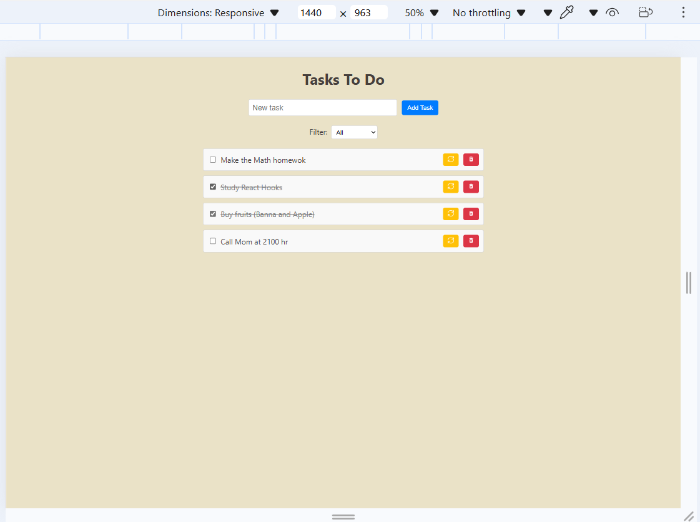
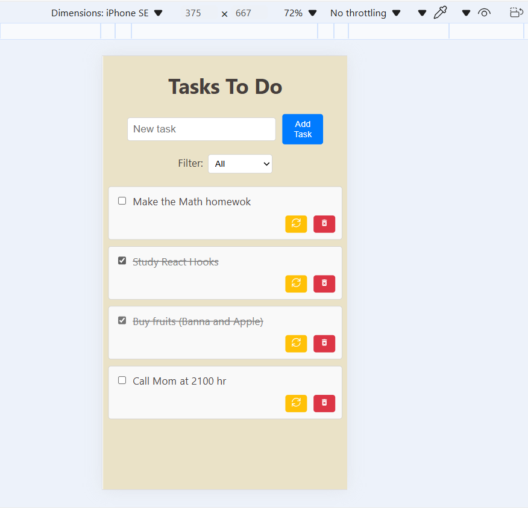

# Tasks Todo App

A simple, responsive, and interactive Todo App built with React. This project helps you manage your tasks effectively with features like adding tasks, editing task names, marking tasks as completed, filtering tasks, and persisting data using localStorage.

## Features

- 📝 Add New Tasks
  Input a task name and click "Add Task" to add it to the list.

- ✅ Mark Tasks as Completed

  - Check the box next to a task to mark it as completed.
  - Completed tasks are styled with a strikethrough.

- 🔄 Edit Tasks

  - Click the Update button to edit a task name.
  - Save the changes by pressing Enter or clicking outside the input.

- ❌ Delete Tasks

  - Remove a task by clicking the Delete button.

- 🔍 Filter Tasks

  - Use the dropdown to filter tasks:
  - All: View all tasks.
  - Completed: View only completed tasks.
  - Incomplete: View only pending tasks.

- 💾 Data Persistence
  - Tasks are saved in the browser's localStorage, so they remain even after refreshing the page.

## Technologies Used

- React: Frontend library for building the UI.
- TypeScript: Ensures type safety across components and hooks.
- CSS: Custom styling for layout and responsiveness.
- localStorage: For persistent data storage.

## Getting Started

1. Prerequisites

- Make sure you have the following installed:
  - Node.js (version 14 or higher)
  - npm or yarn

2. Clone the Repository

   ```
   git clone https://github.com/wichofly/tasks-to-do.git
   cd tasks-to-do
   ```

3. Install Dependencies

```
npm install
```

4. Run the Application

```
npm run dev
```

5. Open in Browser

- Open your browser and navigate to **http://localhost:5173** to view the Task Todo App.

## File Structure

`src/`
Contains all the core code for the app:

```
src/
├── components/
│   ├── TodoApp.tsx      // Main App Component
│   ├── TaskList.tsx     // Renders the list of tasks
│   ├── TaskItem.tsx     // Renders individual task rows
├── hooks/
│   ├── useTask.ts       // Custom hook for task state and logic
├── interface/
│   ├── index.ts         // Defines the Task interface
├── styles/
│   ├── styles.css       // App styling
```

## How the App works

1. **Task Management Logic**
   The app uses a custom React hook (`useTask`) to manage all the task-related logic:

- **State**: Stores tasks, the current filter, and the task input value.
- **CRUD Functions**:
  - Add tasks (`addTask`).
  - Update task names (`updateTask`).
  - Delete tasks (`deleteTask`).
  - Toggle task completion (`toggleCompletion`).
- **Filter Logic**: Filters tasks based on the selected filter (`all`, `completed`, `incomplete`).
- **Persistence**: Saves tasks to `localStorage` using `useEffect`.

2. **Component Structure**

- **TodoApp**: Main component that renders the header, form, filter dropdown, and task list.
- **TaskList**: Displays a list of tasks by rendering a `TaskItem` for each task.
- **TaskItem**: Handles individual task interactions (checkbox, edit, delete).

3. **Styling**
   The app uses CSS for layout and responsiveness:

- **Flexbox**: Aligns elements like the header, tasks, and buttons.
- **Media Queries**: Makes the app mobile-friendly.

## Screenshots

### Desktop View:



### Mobile View:


